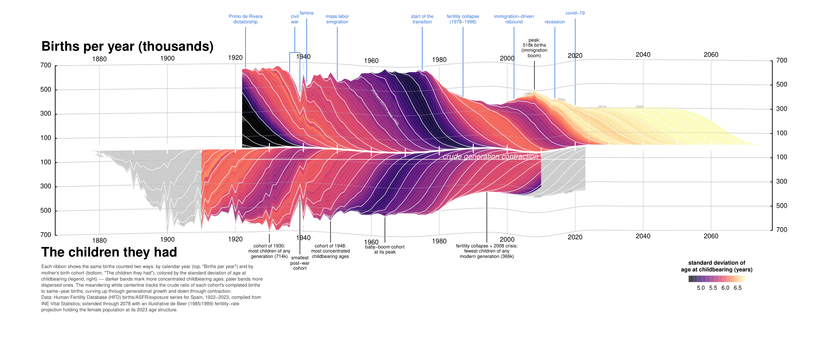

[](https://doi.org/10.5281/zenodo.21791217)

# Replication Archive

Five sequential, independently-runnable stages that reproduce the
figure end to end, each reading/writing its own files on disk. This
folder is self-contained: every script and dependency it needs lives
inside it. The one exception is the input data itself, which is
fetched live from the Human Fertility Database on first run (see
"Data" below) rather than bundled -- required reading before you run
this.

## Requirements

A free HFD account (register at
[humanfertility.org](https://www.humanfertility.org)), with your
credentials set as environment variables:

```
HFD_USER=your_hfd_email
HFD_PASS=your_hfd_password
```

(e.g. in a `.Renviron` file, or exported in your shell before running).

## Running

Run from anywhere:

```
Rscript scripts/run_all.R
```

or step by step:

```
Rscript scripts/01_load_data.R
Rscript scripts/02_projection.R
Rscript scripts/03_series.R
Rscript scripts/04_annotations.R
Rscript scripts/05_figure.R
```

Set `OUT_FORMAT=png` or `OUT_FORMAT=svg` before the last step (or
before `run_all.R`) to export PNG or SVG instead of the default PDF.

## Layout

```
zenodo/
├── scripts/
│   ├── 01_load_data.R
│   ├── 02_projection.R
│   ├── 03_series.R
│   ├── 04_annotations.R
│   ├── 05_figure.R
│   └── run_all.R
├── R/                      # helper functions, trimmed to just what's used
│   ├── Functions.R         # wsd(), groupN(), RR2VV(), draw.fork() only
│   └── Method13_deBeer1985and1989-swe.R
├── data-raw/               # created on first run; HFD downloads cached here (gitignored)
├── data/                   # intermediate .rds per stage (gitignored)
├── figures/                # SpainBirthFlows_paper.{pdf,png,svg} (gitignored)
├── LICENSE                 # MIT, with a carve-out for third-party files in R/
└── README.md
```

## Stages

| # | Script                       | Reads                                                              | Writes                             |
|---|-------------------------------|---------------------------------------------------------------------|-------------------------------------|
| 1 | `01_load_data.R`     | HFD `ESP` birthsVV (fetched live, cached to `data-raw/ESP_birthsVV.rds`)  | `data/01_observed.rds`              |
| 2 | `02_projection.R`      | `data/01_observed.rds`; HFD `ESP` asfrRR/exposRR (fetched live, cached to `data-raw/`; only if the projection cache is missing); sources `R/Functions.R` for `RR2VV()` | `data/02_combined.rds` (and caches `data/ESP_births_proj.rds`) |
| 3 | `03_series.R`           | `data/02_combined.rds`                                              | `data/03_series.rds`                |
| 4 | `04_annotations.R`     | *(none -- static annotation content)*                               | `data/04_annotations.rds`           |
| 5 | `05_figure.R`            | `data/03_series.rds`, `data/04_annotations.rds`                     | `figures/SpainBirthFlows_paper.{pdf,png,svg}` |

Stage 1 loads the raw HFD observed series. Stage 2 builds (or reuses a
cached) de Beer fertility-rate projection and combines it with the
observed series into one dataset capped at the last confident mother
cohort. Stage 3 is the heaviest step: it builds the period-cohort
matrix, the stream geometry, the meandering centerline, the guide
gridlines, and the standard-deviation color bands. Stage 4 defines the
figure's text content (event markers, callouts) as plain data,
independent of everything else, so the annotation wording can be
reviewed or edited without touching any plotting code. Stage 5 reads
the two data products from stages 3 and 4 and draws the final figure.

`data/` holds only intermediate `.rds` files regenerated by each run;
it is not meant to be committed with tracked content beyond a
`.gitkeep`.

Note: stage 2's `RR2VV()` call only runs when the projection cache
(`data/ESP_births_proj.rds`) is missing -- delete that cache to force a
fresh projection run if you've changed anything upstream of it.

## Data

Observed data (1922-2023) are drawn from the Human Fertility
Database's Spain series (birthsVV, asfrRR, exposRR), compiled by
Daniel Devolder from Instituto Nacional de Estadistica (INE) Vital
Statistics -- birth bulletins filed by Civil Registries with INE's
provincial delegations. The series is extended through 2078 with an
illustrative de Beer (1985) fertility-rate projection.

Per the [HFD User Agreement](https://www.humanfertility.org/Data/UserAgreement),
downloaded data is not bundled in this archive: input data "should not
be... re-published in any form without the explicit permission of the
data owners," and the agreement generally discourages sharing
downloaded copies, asking that users instead be referred to the HFD
website to download the data themselves. Stages 1 and 2 fetch the
series live via `HMDHFDplus::readHFDweb()` on first run, using your own
HFD credentials, and cache the result locally to `data-raw/` (gitignored)
so repeat runs don't re-download.

### Citation

Per the HFD User Agreement, cite the Human Fertility Database as:

> HFD. Human Fertility Database. Max Planck Institute for Demographic
> Research (Germany) and Vienna Institute of Demography (Austria).
> Available at www.humanfertility.org. Data downloaded on [date].

Per Riffe et al. (2019) original figure and paper:

> Riffe, Tim; Barclay, Kieron; Klüsener, Sebastian; Bohk-Ewald, Christina 2019: _Boom, echo, pulse, flow: 385 years of Swedish births_.
> MPIDR Working Paper WP-2019-002. Rostock: Max Planck Institute for Demographic Research. [https://doi.org/10.4054/MPIDR-WP-2019-002](https://doi.org/10.4054/MPIDR-WP-2019-002)


## License

MIT (see `LICENSE`). `R/Functions.R` (originally by Tim Riffe) is
included under this license with his permission. `R/Method13_deBeer
1985and1989-swe.R` (credited to "CBE, PL and MM", 2016) is a carve-out
-- included with attribution but not covered by this license grant --
see `LICENSE` for details.
